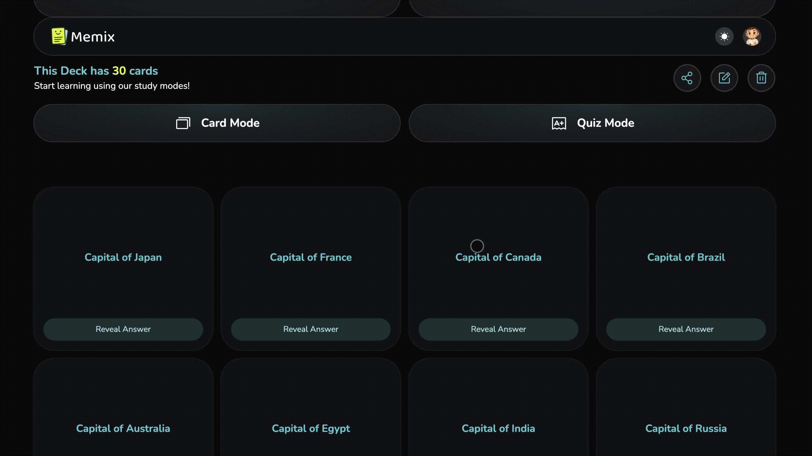
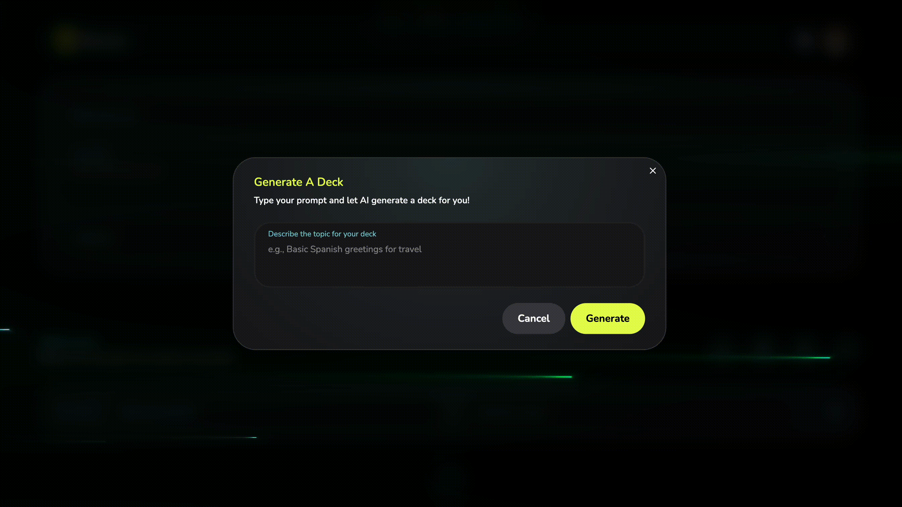

  

**Memix** is a playful flashcard app that helps you learn anything faster.  
Create custom decks, flip through fun, focused cards, and boost your memory with smart repetition.  
This was our **final group project at [HackYourFuture](https://www.hackyourfuture.net/)**, built with the MERN stack and Agile workflow.

## 🔗 Links
- 🚀 [Live Demo](https://c52b.hyf.dev)
- 📂 [Original Repository](https://github.com/HackYourFutureProjects/c52-final-project-group-B)
- 🎥 [Pitch Video](https://youtu.be/QFZ5JKJcIFU)

## Tech Stack

### Frontend  
 
 
  

### Backend  
 
  

### Database  
  

### Other  
 
 
 
  

## Screenshots

### Home Page

### Flashcards in Action

### AI Generate

## Features

- Create and browse custom flashcard decks  
- Flip through cards with smooth interaction  
- Smart repetition for effective learning  
- AI-assisted card generation using OpenAI API
- Sign up, log in, and reset passwords
- Responsive layout for desktop and mobile  

## My Role

- Contributed to both frontend and backend development  
- Worked on multiple features across the application (UI components, API integration, validation)  
- Participated in design discussions, code reviews, and agile ceremonies (sprint planning, standups, retrospectives)  
